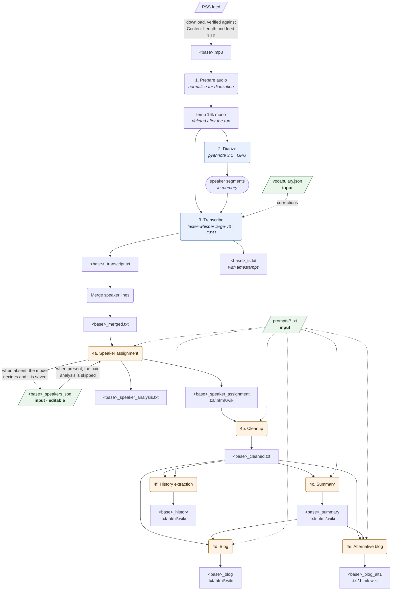
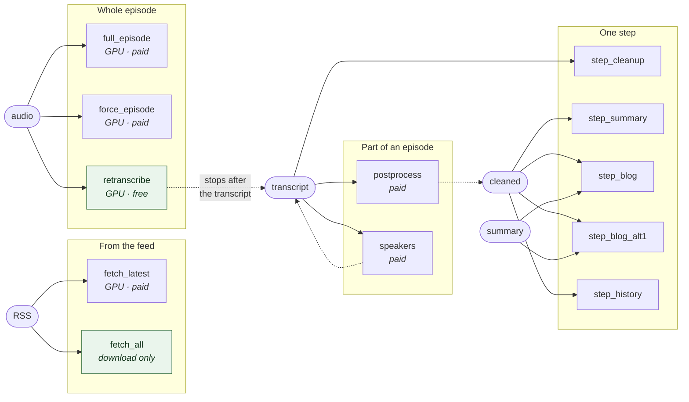

# The WHYcast pipeline

How an episode becomes a transcript, a summary and a blog post, which files
each step reads and writes, and which job re-runs which part.

Drawn from the code, not from memory: `whycast/pipeline/workflow.py` for the
stages, `whycast/pipeline/postprocess.py` for the language-model steps, and
`webui/runner.py` for the job types.

## The pipeline

Rounded boxes are steps, plain boxes are files on disk. Anything with `<base>`
is per episode - `episode_13_summary.txt` and so on.

Blue steps hold the GPU. Amber steps call the paid OpenAI API. Green boxes are
**inputs**: files a person edits and the pipeline reads. They are never
overwritten by a run, and never moved to the backup - that distinction is what
ADR-010 and ADR-011 are about.

## Which job re-runs what

Every job below starts by moving the artifacts it will replace into
`backups/<base>/<timestamp>/`, so a re-run never overwrites the previous
version (ADR-011).

`retranscribe` is the only GPU job that spends nothing: it redoes the audio
half and stops, which is what you want after changing the Whisper model, the
vocabulary or the diarization settings. Its counterpart is the single-step
re-run: one model call to redo one output, instead of four to see one change.

## The two rules that shape all of this

**Inputs are read, outputs are written, and nothing is both by accident.**
`vocabulary.json`, `prompts/*.txt` and `<base>_speakers.json` are human input:
edited by a person, read by the pipeline, backed up with a `.bak` when saved,
and never regenerated. Everything else is an artifact: regenerable, no `.bak`,
moved aside before a run replaces it.

`<base>_merged.txt` is the one file that is genuinely both - speaker assignment
writes it, post-processing reads it - which is why a run copies it to the
backup instead of moving it away.

**A step that does not run does not lose its output.** The speaker analysis is
skipped when a saved mapping exists, and the alternative blog is skipped when
its prompt file is absent. Their artifacts are moved aside at the start of a
run like any other, and put back at the end when the run turns out not to have
replaced them.

## Related decisions

- **ADR-001**, **ADR-002** - the GPU half: faster-whisper on CUDA, pyannote for diarization.
- **ADR-003**, **ADR-005** - per-task model selection and recursive summarization.
- **ADR-004**, **ADR-010** - speaker assignment in two phases, and the mapping as an editable input.
- **ADR-006**, **ADR-007** - vocabulary corrections and file-based prompts.
- **ADR-008**, **ADR-009**, **ADR-011** - the web UI over this library, and how artifacts are written and preserved.
